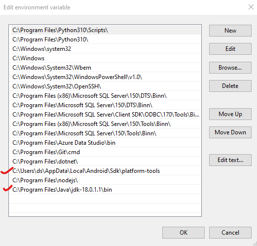

# React-Native CLI

[React-Native CLI](https://reactnative.dev)

To get started with ```react-native-cli``` you require to have the XCode or [Android Studio](the-studio) setup on your system.

To setup react-native-cli on your computer

```bash
npm install -g react-native-cli
```


## Tools for Android

### Android-Studio

Android Studio is Android's official IDE and can be downloaded from [developer.android.com](https://developer.android.com/studio/index.html).

At the time of installation make certain to select the following components...

* Android SDK
* Android SDK Platform
* Android Virtual Device

If you miss these out at the time of installation, you can install these later on.

A copy of the latest OpenJDK comes bundled with Android Studio.

:::tip

I start Android Studio periodically and let it update / upgrade itself, gradle and its libraries.

:::

### JDK

React-native requires OpenJDK11 or later to build the react-native apps for android. This can be downloaded from [jdk.java.net](https://jdk.java.net/). If you have install Android Studio then a copy of the latest OpenJDK is already installed on your system.

## Environment Variables

You should also check out that ANDROID_HOME and JAVA_HOME environment variables are set.


### Set ANDROID_HOME


```ANDROID_HOME``` should point to the path to your *Android SDK*. 

### Set JAVA_HOME


```JAVA_HOME``` should point to the path where the OpenJDK is installed. 

### Set PATH

To the PATH variable add the path of...
1. the ```platform-tools``` in the Android SDK folder
2. the ```bin``` folder inside the OpenJDK folder.



:::note

Some software automatically set these environment variables at the time of installation. So, if you find any of these variables already existing just ensure there values are ok.

:::