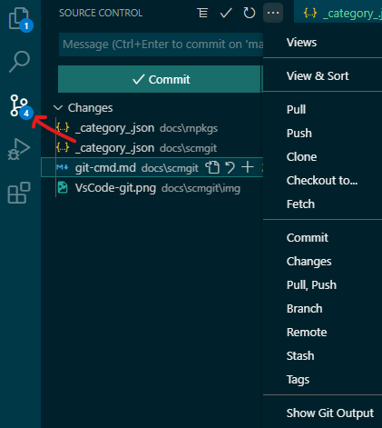

# Editor and Extensions

Technically speaking, you need a simple text editor for development in react-native. But, using a dedicated programming editor changes the way you can manage multi-file projects.

## Visual Studio Code

There are a host of configurable editors out there. For me, [Visual Studio Code](https://code.visualstudio.com/) by Microsoft was the clear winner. Its strength included...

### Intellisense

It goes beyond syntax highlighting and auto-completes. It is able to provide *smart completes* based on variable types, definitions and imported modules.

### Run and Debug

I am able to run my code from with-in the editor and even debug with break-points, call stacks et al.

### Built-in Git

Git is built-in VsCode making *source code management* (SCM) very easy. I use it all the time to push, pull, sync from GitHub.

### Extensions

It is highly customizable with a plethora of extensions which make it very friendly, powerful and alive. I like the way the editor responds to different parts of the code and errors / mistakes.

I use Visual Studio Code (a.k.a. VSCode or Code) for editing and testing all my Javascript, Python, JSON, React and React-Native code.

## VsCode Extensions that I Use

VSCode was created with extensibility in mind and almost every part of it can be customized. Plenty of extensions are available that enable linting and debugging of react-native codes.

I use the following extensions with react-native...

* **React Native Tools** by Microsoft
* **ES7+ React/Redux/React-Native snippets** by dsznajder
* **ESLint** by Microsoft
* **Auto Complete Tag** by Jun Han
* **Color Highlight** by Sergii N

For, my Python projects I have...

* **Python** from Microsoft
* **Pylance** from Microsoft

There is a huge list of extensions to select from. If you are up to it, VSCode comes with an [Extension API](https://code.visualstudio.com/api), that you can use to create your own extension.

Some other extension that I have VS Code include...

* **vscode-icons** by VSCode Icons Team
* **Prettier** by Prettier

## git - Source Control Manager

**git** source control management is built into vsCode. It integrates with my GitHub account and makes it easy to manage and share my source code.

It allows me to carry out my git tasks either through its interactive menu or by typing them in the terminal.

