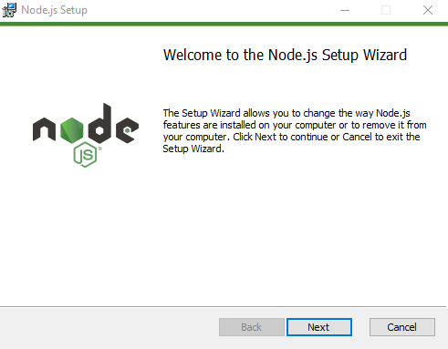
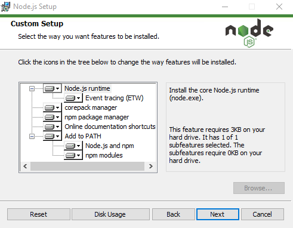

# The Environment

## Node

React-native development can be done through the Expo CLI or React-Native-CLI. Both require node to work. So make sure you have the latest node on your system.

Node is available at [NodeJS Site](https://nodejs.org). Download the proper installer file depending on your OS and install it.

My operating system is Windows and I chose to use the MSI installer. The installation was quick and simple.



### Upgrade Node

To upgrade to the latest version of node, simply download the new version from the [nodejs](https://nodejs.org) site and install it. If it finds `node` on your computer, it will be upgraded, otherwise node will installed.

## Package Managers

You will require a good Package Manager to work with the various packages in your react-native projects. You will also require it, if you wish to develop and publish your own package. In fact, package managers are required for any node based projects to handle the node-modules that will be used.

### npm

[**npm** by npmjs.com](https://www.npmjs.com/) is the standard package manager for Node.js. ```npm``` is included in the standard node installation package.



To upgrade to the latest version of npm.

```bash
npm install -g npm@latest
```

[Click Here!](../npm/the-npm) to jump to NPM page now.

### yarn and pnpm

[yarn](https://yarnpkg.com) and [pnpm](https://pnpm.io) are alternatives to the npm cli. Every any software each package manager has its strengths and weaknesses.

```bash
npm install -g yarn
yarn -v
```

to upgrade to the latest stable version of yarn...

```bash
yarn set version stable
```

You may also want to give `pnpm` a try...

```bash
npm install -g pnpm
```

:::note 

I did try out `yarn`, but have stuck to using  **`npm`** on a regular basis.

:::

## Install the CLI

Now you will need [expo-cli](expo-cli.md) or [react-native-cli](rn-cli.md) to proceed. I use the [react-native-cli](rn-cli.md) and that is the focus of discussion here.
