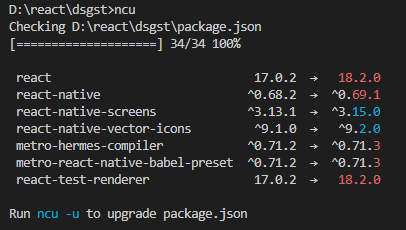

# Installed Globally

Packages installed globally offer CLI-commands to maintain the project and the packages in your project.  

## react-native-rename

Renames my react-native app with a single command. Works properly with **Android**, suits me because so far my apps are being built for Android. Install the package as `global`.

```bash
npm install -g react-native-rename
```

This is useful if you want to rename the package.

```bash
react-native-rename <newname> -b <bundleIdentifier>
```

```bash title="Example"
react-native-rename myapp -b info.dataspec.myapp
```

:::info Note

This package does not attempt to properly rename build artifacts such as ios/build or Cocoa Pod installation targets. After renaming your project you should clean, build, and reinstall third party dependencies to get it running properly with the new name.

:::

To learn more about this rename package visit [www.npmjs.com/package/react-native-rename](https://www.npmjs.com/package/react-native-rename)

## npm-check-updates

I find `npm-check-updates` very useful in keeping track of the available updates for the packages included in the `dependencies` objects in the `package.json`.

To install.

```bash
npm install -g npm-check-updates
```

To get the latest available update for any installed package.

```bash
ncu
```



To update `package.json` with the latest version discovered by ncu.

```bash
ncu -u
```

:::caution Commit and Push before Update

Commit and Push to your version control before you update any package. Some packages require you to update or change your code to work properly.

:::

This will update the versions of the packages listed in the `package.json` with the [version identifier](../basics/npm/pkg-ver) of the latest available update.

**`ncu`** supports a wide choice of `options` to fine-tune the way ncu checks for updates. Check [npm-check-updates documentation](https://www.npmjs.com/package/npm-check-updates) for more details

:::info

you should clean, build, and reinstall third party dependencies to get it running properly with the new updated packages

::::
