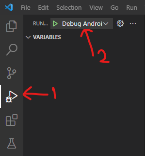
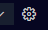
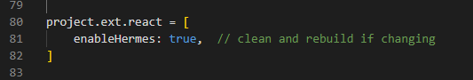
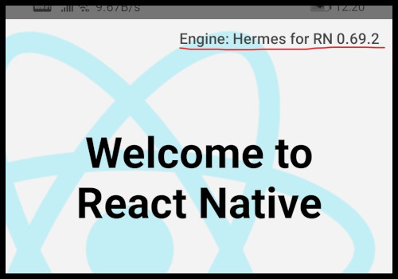

# Start New Project

## Initialize a project

Start your command / terminal and `cd` to the folder where you want the new project to reside.

```bash
d:
cd \rnp
npx react-native init myproj
```


This will create a folder named `myproj` and create the new project based on the default template.

To check it out all you need to do is connect your mobile


The content of the project folder at the time are startup have folders...

| Folders | Description |
|:---|:---|
| **`android`** | contains the files needed to build the android app |
| **`ios`** | contains the files needed to build the ios app |
| **`node_modules`** | contains all the local packages installed by the package manager |
| **`__test__`** | contains the test files with your first test ready to run |

and the configuration files...

| Files | Description |
|:---|:---|
| **`package.json`** | Configuration file used by [npm](../category/package-manager) |
| **`.buckconfig`** | Configuration file used by [buck.build](https://buck.build/) |
| **`.eslintrc.js`** | Configuration file used by [ESLint](https://eslint.org/) |
| **`.flowconfig`** | Configuration file used by [Flow](https://flow.org/en/) |
| **`.gitignore`** | Configuration file used by [git](https://git-scm.com/) |
| **`.prettierrc.js`** | Configuration file used by [Prettier](https://prettier.io/) |
| **`.ruby-version`** <br /> **`gemfile`**| Configuration files use by [ruby](https://prettier.io/) |
| **`.watchmanconfig`** | Configuration file used by [watchman](https://facebook.github.io/watchman/) |
| **`babel.config.js`** | Configuration file used by [babel](https://babeljs.io/) |
| **`metro.config.js`** | Configuration file used by [metro](https://facebook.github.io/metro/) |

the react-native source files...

| Files | Description |
|:---|:---|
| **`index.js`** | The Entry Point for the react-native app |
| **`app.json`** | File imported by index.js |
| **`App.js`** | The file with the react-native component that will be visible when the app starts |

## Open the Code in VSCode

### From Command Prompt

At the command prompt, navigate to your project folder and run the command

```bash title="Launch Visual Studio Code"
code .
```

awhere . is the (current) path in which vscode should start.

### From GUI

Open VSCode from the menu / desktop or where-ever it is.


and use Open Folder option to open the root folder of the project.

:::tip
I have it pinned to both - TaskBar and Start.
:::

## Run the App

Connect your android phone, and run the command

```bash title="For Android"
npx react-native run-android
```


To run on the iphone, the command is

```bash title="For IOS"
npx react-native run-ios
```

To run the test just type in `jest`

```bash title="Run Test"
jest
```

## Initiate Debug

Extension required **React Native Tools**

Select the Run View (Ctrl+Shift+D).


If the `launch.json` is not set you will get the option to create one.



If the `launch.json` is set you can click  in the View to select the debugger.

In the command palette, Select Debugger as React Native and select **Debug Application** or **Debug Application Hermes - Experimental** as applicable. I prefer to work with the `hermes enabled` environment (we shall see how this is done [below](./first-step)) and set my debugger to _Debug Application Hermes - Experimental_.

To start debugging - Select Debug ... from the drop-down and click Run or use the keyboard shortcut `[F5]` to start.

VSCode allows code steps with features like watch, breakpoints, variables and call-stacks.

## enable Hermes

**Hermes** is an open-source javascript engine optimized for React Native. At this time Hermes is an opt-in React Native feature you have to enable it.


Open file `androd/app/build.gradle`.


and make **`enableHermes: true`**.



You will have to clean and rebuild your app.

```bash clean and rebuild
cd android
gradlew clean
cd ..
npx react-native run-android
```



There are additional settings if you are using ProGuard.

## Next Steps

So far, we have just set our environment and prepared our editor for this project. Now we are ready to start working with the code. Let us proceed to the [first step](./first-step).
