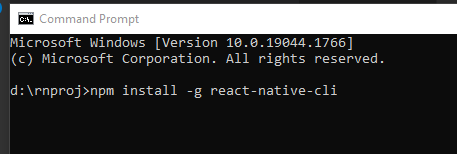

# React-Native CLI

[React-Native CLI](https://reactnative.dev)

To get started with ```react-native-cli``` you require to have the XCode or [Android Studio](the-studio) setup on your system.

```bash title="setup react-native-cli on your computer"
npm install -g react-native-cli
```



## Tools for Android

### Android-Studio

Android Studio is Android's official IDE and can be downloaded from [developer.android.com](https://developer.android.com/studio/index.html).

At the time of installation make certain to select the following components...

* Android SDK
* Android SDK Platform
* Android Virtual Device

If you miss these out at the time of installation, you can install these later on.

A copy of the latest OpenJDK comes bundled with Android Studio.

### JDK

React-native requires OpenJDK11 or later to build the react-native apps for android. This can be downloaded from [jdk.java.net](https://jdk.java.net/). If you have install Android Studio then a copy of the latest OpenJDK is already installed on your system.
