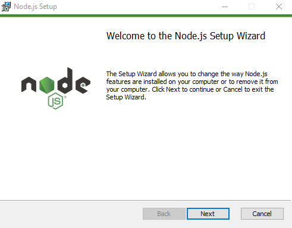
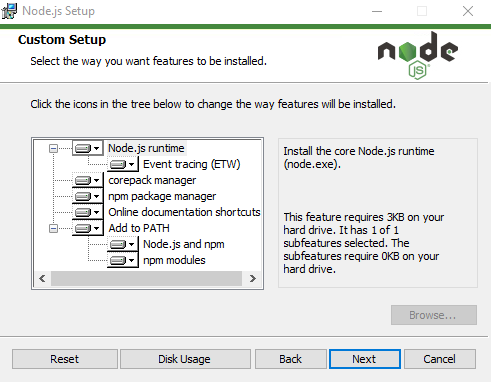

# The Environment

## Getting Started

> ### [Expo Snack](https://snack.expo.dev/)
>
> A good place to start with react-native. No setup - No Installs. Just open the side, code in and execute. Just click [Snack](https://snack.expo.dev/) and get started.

To start serious app development work, you will need either ```expo-cli``` or ```react-native-cli```.

## Node

Both Expo CLI and React-Native-CLI require node on your computer. So download the Installer file depending on your OS and installed it.

Node is available at [NodeJS Site](https://nodejs.org).  

My installation in Windows was quick and simple.



I chose to use the MSI installer.

>### Upgrade Node
>
>To upgrade to the latest version of node, simply download the new version from the [nodejs](https://nodejs.org) site and install it. It knows what to do with your previous installation and replaces it with the new version.

## Package Managers

You will require a good Package Manager to work with the various packages in your react-native projects. In fact, package managers are required for any node based projects to handle the node-modules that will be used.

### npm

[**npm** by npmjs.com](https://www.npmjs.com/) is the standard package manager for Node.js. ```npm``` is included in the standard node installation package.



You may want to upgrade to the latest version of npm.

```bash
npm install -g npm@latest
```

We shall discuss more on how to use the npm cli commands. [Click Here!](the-npm.md) to jump to NPM page.

### yarn

[yarn](https://yarnpkg.com) and [pnpm](https://pnpm.io) are alternatives to the npm cli. I have been using ```yarn``` for sometime now.

```bash
npm install yarn
yarn -v
```

to upgrade to the latest stable version of yarn...

```bash
yarn set version stable
```
